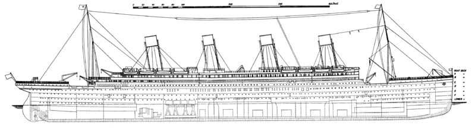
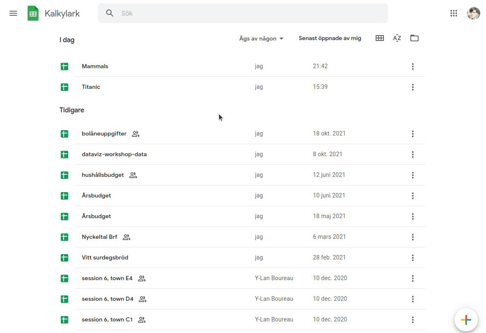
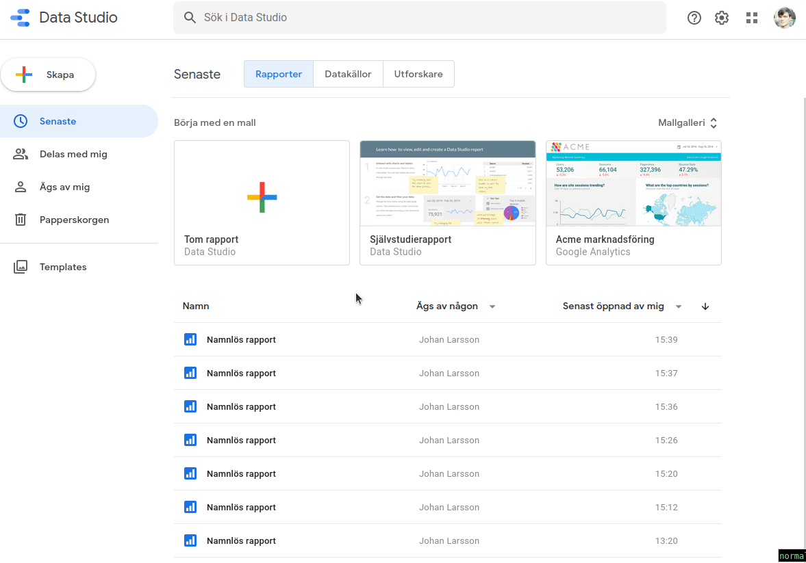
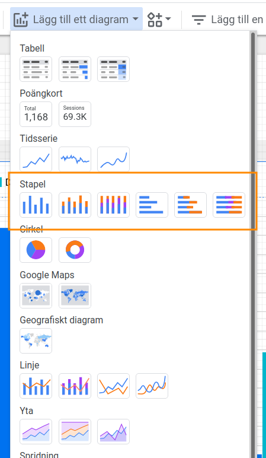
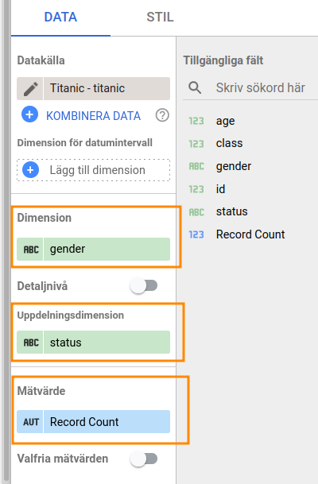
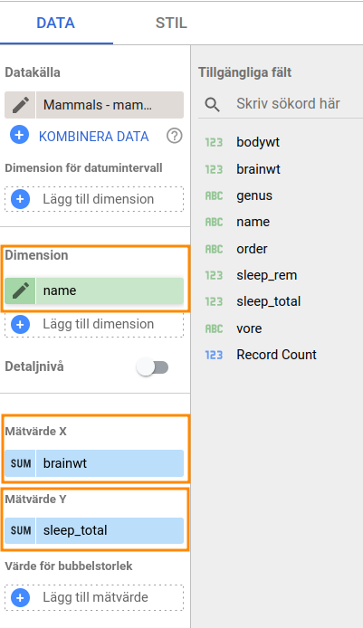
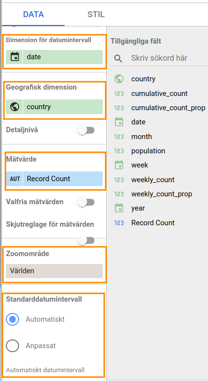

```{r setup, include = FALSE}
knitr::knit_hooks$set(crop = knitr::hook_pdfcrop)

fw <- 4.8
fh <- 4.1

knitr::opts_chunk$set(
  echo = FALSE,
  warning = FALSE,
  message = FALSE,
  cache = FALSE,
  dev = "png",
  fig.width = fw,
  fig.height = fh,
  fig.align = "center",
  fig.retina = 3,
  dev.args = list(pointsize = 16),
  crop = TRUE
)

library(tidyverse)
library(kableExtra)

kable <- function(x, ...) {
  knitr::kable(x, escape = FALSE, linesep = "", booktabs = TRUE)
}

# library(RefManageR)
# BibOptions(check.entries = FALSE, 
#            bib.style = "authoryear",
#            style = "markdown",
#            dashed = TRUE)
# bib <- ReadBib("assets/references.bib")

if (!interactive()) {
  theme_set(theme_minimal(base_size = 16))
}

#xaringanExtra::use_search(show_icon = TRUE)

options(digits = 3)
```

## Dagens upplägg

### 09:00 - 10:30

- Grunder
- Visualisering av proportioner och antal
- Visualisering av numerisk data
- Kartor

### Paus

### 10:45 - 12:00

- Nätverksvisualiseringar med VOSviewer

---

## Varför visualisera data?

- Visualisering är vårt främsta verktyg för att förstå data.

---

## Beståndsdelar

.pull-left[
- Data
- Geometri
- Titlar
- Axlar
- Legender (eventuellt)
- Figurbeskrivning (eventuellt)
]

.pull-right[
```{r, fig.cap = "Fuel Consumption in miles per gallon and horsepower for a set of cars from the 1974 Motor Trend US magazine.", fig.height = fh*1.3}
library(ggplot2)

ggplot(mtcars, aes(hp, mpg, col = as.factor(cyl))) +
  geom_point() +
  labs(
    x = "Horsepower",
    y = "Fuel Consumption (Miles per Gallon)",
    color = "Cylinders"
  ) + 
  theme(legend.position = "bottom") 
```
]


---

## Principer

- Föredra multivariata visualiseringar

--

- Glöm inte bort läsaren/åhöraren!

--

- Story-telling

--

- Använd "bläcket" på **data**


---
 
## Data och skalnivåer

Data kommer i många olika typer:

```{r}
library(tidyverse)
tab <- tribble(
  ~Skala, ~Exempel, ~Värden,
  "Nominal", "Kön", "Man/Kvinna",
  "Ordinal", "Utbildningsnivå", "Grundskola, Gymnasial, Högskola",
  "Intervall", "Temperatur i Celsius", "-1, 0, 1, 2",
  "Kvot", "Längd", "0, 0.5, 1, 1.5"
)
tab %>%
  knitr::kable()
```

--

Numerisk data (intervall och kvot) kan också delas upp i diskret data (heltal)
och kontinuerlig (reell) data

---

## Google Data Studio

Enkelt och gratis men inte speciellt kraftfullt.

Mer seriösa projekt kräver mer avancerade program, exempelvis R (ggplot2),
Julia, eller python (matplotlib).


### Exempel: Titanic

Vem överlevde Titanics haveri?

Ladda ner `titanic.csv` från workshop-hemsidan
[stat-lu.github.io/lu-workshop](stat-lu.github.io/lu-workshop) och importera in
i Google Kalkylark (Sheets).

```{r}

```

---

### Uppgift 1: Utforska 

```{r out.width = "80%"}

```

För varje variabel (kolumn) beskriv vilket **skalnivå** de har.

---

### Uppgift 2: Importera till Google Data Studio

```{r}

```

---

## Stapeldiagram

.pull-left[
- Enkelt, lättförståeligt
- Visualiserar **antal** eller **proportioner**

```{r, fig.width = 3.3, fig.height = 2.8}
ggplot(mtcars, aes(as.factor(cyl))) +
  geom_bar() +
  labs(x = "Cylinders", y = "Count")
```

### Olika typer

- Grupperade eller staplade
- Proportion eller antal
]

.pull-right[
```{r, out.width = "80%"}

```
]

---

### Stapeldiagram i Data Studio

.pull-left[
#### Dimension

x-axeln

#### Uppdelningsinformation

färg

#### Mätvärde

transformation (antal, summa, medelvärde)
]


.pull-right[
```{r, out.width = "80%"}

```

]

---

### Uppgift 3: Stapeldiagram

#### Huvuduppgift

Använd stapeldiagram för att visualisera hur överlevnad på Titanic varierar
mellan könen och de olika klasserna på fartyget.

- Testa både grupperade stapeldiagram och staplade stapeldiagram.
- Prova visualisera både proportioner och antal.
- Vilken variabel ska kopplas till *dimension* och vilken till 
  *uppdelningsdimension*? Prova olika alternativ!

Vad är era slutsatser?

Tips: Enklaste sättet att byta mellan diagramtyper är via *STIL*-fliken.

#### Bonusuppgift

- Ändra färg på staplarna och byt från liggande till stående staplar.
- Gör enskilda diagram för de olika passagerarklasserna via *Filter* och 
  visualisera uppdelningen mellan kön inom varje.

---

## Spridningsdiagram

- Standardvalet för visualiseringar av två variabler.
- Fundera över beroendet mellan de variablerna du ska visualisera:
  om det finns ett tydligt "utfall", placera det på y-axeln.
  
.pull-left[
```{r}
ggplot(mtcars, aes(mpg, hp)) +
  geom_point() +
  labs(x = "Horsepower", y = "Fuel Consumption")
```
]

.pull-right[
```{r}
ggplot(mtcars, aes(hp, mpg)) +
  geom_point() +
  labs(y = "Horsepower", x = "Fuel Consumption")
```
]

---

### Numerisk data: Däggdjur, hjärnstorlek och sömn

- Gå till workshopshemsidan och ladda ner datasetet `mammals.csv`.
- Importera det till Google Sheets
- Importera det till Google Data Studio

#### Variabler

- `bodywt`: kroppsvikt
- `brainwt`: hjärnvikt
- `genus`: släkte
- `order`: ordning
- `sleep_rem`: längd på REM-sömn
- `sleep_total`: längd på sömn
- `vore`: "matvanor"

---

### Spridningsdiagram i Data Studio

Välj *Lägg till ett diagram* följt av *spridningsdiagram*.

.pull-left[
#### Dimension

- variabel som särskiljer observationerna
- kan användas för att aggregera information
- ange `name` till att börja med

#### Mätvärde X

- variabel för x-axeln


#### Mätvärde Y

- variabel för y-axeln
]

.pull-right[
```{r, out.width = "80%"}

```
]

---

### Uppgift 4: Spridningsdiagram

#### Huvuduppgift

- Gör spridningsdiagram mellan total sömn och hjärnvikt eller kroppsvikt.
- Fundera över vilka variabler som ska vara på y- och x-axlarna.
- Testa att ändra till log-skalor via *STIL*-fliken.
- Ge axlarna korrekta titlar.

Vad är slutsatserna? Hur ser sambanden ut mellan kroppsvikt, hjärnvikt och
sömn?

#### Bonusuppgift

- Gör ett bubbeldiagram genom att koppla en variabel till 
  *Värde för bubbelstorlek*. Hur lätt är det att avläsa värdena från 
  bubblorna?
- Aggregera data över matvanor (`vore`), `genus`, eller `order` genom att
  byta variabel i *Dimension*.
  - Ändra `SUM` brevid variabeln till något rimligare.

---

## Kartor

Data har ofta en spatiell dimension, utnyttja det!

.pull-left[
```{r, fig.cap = "Choropleth", fig.height = 5.5}
library(rnaturalearth)
library(sf)

bbox <- c(
  xmin = -8,
  xmax = 40,
  ymin = 35,
  ymax = 70
)

scandinavia <- ne_countries(scale = 50, returnclass = "sf")  %>%
  filter(admin %in% c("Sweden", "Norway", "Denmark", "Finland")) %>%
  mutate(gdp_per_capita = gdp_md_est/pop_est) %>%
  st_crop(bbox)

ggplot(scandinavia) +
  geom_sf(aes(fill = gdp_per_capita), col = "black") +
  coord_sf() +
  scale_fill_distiller(direction = 1) +
  labs(fill = "GDP/capita") +
  theme_void(base_size = 16) +
  theme(legend.position = c(0.1, 0.8))
```

]

.pull-right[
```{r, fig.cap = "Bubbeldiagram", fig.height = 5.5}
centers <- st_point_on_surface(scandinavia)

ggplot(scandinavia) +
  geom_sf(col = "black") +
  geom_sf(data = centers, aes(size = gdp_per_capita), col = "dark orange") +
  scale_size(range = c(5, 10)) +
  coord_sf() +
  scale_fill_distiller(direction = 1) +
  labs(size = "GDP/capita") +
  theme_void(base_size = 16) +
  theme(legend.position = c(0.1, 0.8))
```

]

---

### Spatiell data: Fall av CoViD-19 i Europa

- Gå till workshopshemsidan och ladda ner datasetet `covid.csv`.
- Importera det till Google Sheets
- Importera det till Google Data Studio

#### Variabler

- `country`
- `date`: datum (ett för varje vecka)
- `year`
- `month`
- `week`
- `population`
- `weekly_count`: antal fall vecka för vecka
- `cumulative_count`: kumulativa fall
- `*_prop`: proportionella mått

---

### Kartor i Data Studio


Välj *Lägg till ett diagram* följt av *Geografiskt diagram*.

.pull-left[
#### Geografisk dimension/plats

geografisk enhet (land, län, kommun)

#### Mätvärde

variabel att koppla till färg 

#### Zoomområde

zooma in kartan på ett särskilt område

#### Standarddatumintervall

filtrera ut ett datumintervall
]

.pull-right[
```{r, out.width = "70%"}

```
]

---

### Uppgift 5: Karta

#### Huvuduppgift

- Skapa en karta för proportionella antal fall av CoViD-19 hittills över
  2021.
- Zooma-in kartan på enbart Europa.
- Justera färgskalan till något mer passande med tanke på datan.
- Vilket land i Europa hade det högsta antalet nya fall (proportionerligt sett)
  över hela tidsperioden?
- Skapa två enskilda diagram: ett över 2020 och ett över 2021 och
  placera dem sida vid sida för att jqmföra exempelvis det totala antalet fall.
  
#### Bonusuppgift

- Skapa ett bubbeldiagram med hjälp av *Google Maps/Bubbelkarta*. Testa
  olika kombinationer av variabler och koppla till både storlek på
  bubblorna och färg.
- Testa göra en choropleth med *Google Maps*.

---

## Nätverksdiagram

Nätverksdiagram för bibliometrisk data: [VOSviewer](https://www.vosviewer.com)

### Input

- text (abstract, titlar)
- bibliometrisk data (författare, citeringar, referenser, etc.)

--

.pull-left[
### Noder (Unit of Analysis)

Varje nätverksdiagram är byggt upp av *noder*. Noden i diagrammet kan utgöras
av olika objekt, exempelvis:

- författare
- organisation
- artikel
- land
]

--

.pull-right[
### Relatedness

Kopplingen mellan varje nod (relatedness) bestäms av ett mått:

- Co-authorship
- Co-occurence
- Citation
- Bibliographic coupling
- Co-citation
]

---

### Uppgift 5: 

Gå till workshopshemsidan och ladda ner datasetet `library.ris`.


